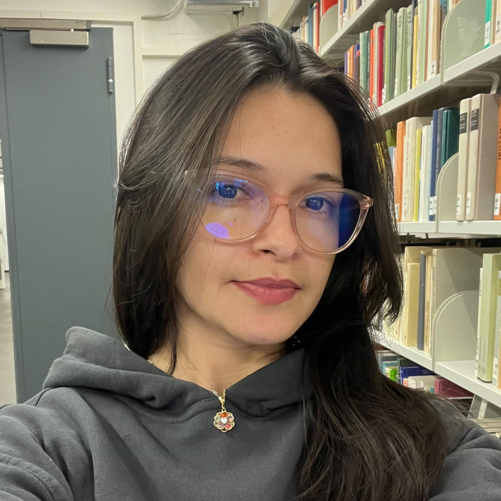

###### Este repositório contém o código e os resultados do artigo publicado no KDMiLe 2026.

# KG-RAG: Uma Arquitetura de Recuperação Híbrida para Documentos Normativos Institucionais

## Resumo
Instituições de ensino superior lidam diariamente com documentos normativos hierárquicos complexos, um cenário onde sistemas tradicionais de Geração Aumentada por Recuperação (RAG) sofrem com fragmentação de contexto e alucinações. Além disso, a gestão de dados públicos exige processamento estritamente local para garantir a soberania tecnológica. Para superar essas limitações, este artigo propõe e avalia a arquitetura Knowledge Graph RAG (KG-RAG), um pipeline híbrido aplicado ao ecossistema documental da Universidade Federal do Oeste do Pará (UFOPA). O modelo integra uma ontologia institucional, *Contextual Chunking* e decomposição de consultas para isolar as fronteiras administrativas antes da geração da resposta, processando um corpus de 11.047 fragmentos (chunks). Uma avaliação empírica usando o framework RAGAS demonstrou que a abordagem superou um modelo base (baseline) híbrido padrão, alcançando ganhos de 30,1% em Fidelidade (*Faithfulness*) e 35,2% em Revocação de Contexto (*Context Recall*). Os resultados evidenciam que a recuperação guiada por relações lógicas mitiga a perda de contexto em normativas profundas, garantindo exatidão informacional e privacidade em ambientes governamentais fechados.

## Publicação e Base de Dados
> O repositório foi impulsionado pela proposta e avaliação da arquitetura KG-RAG aplicada ao ecossistema documental da Universidade Federal do Oeste do Pará (UFOPA). A pesquisa foi aceita e publicada no seguinte evento científico:
- Simpósio Brasileiro de Descoberta de Conhecimento, Mineração e Aprendizado (KDMiLe) 2025

  | Tipo de Documento | Fonte | Total Processado |
  | :-----: | :------------------: | :-----: |
  | Relatórios de Gestão | UFOPA (2024-2026) | 2 |
  | Boletins de Serviço | UFOPA (2024-2026) | 31 |
  | **Total** | **Ecossistema UFOPA** | **33** |

## Conteúdo
1. [Script de Ingestão (ingest_kg_rag.py)](ingest_kg_rag.py): Pipeline para extração multimodal de PDFs usando PyMuPDF4LLM, limpeza de dados, *Contextual Chunking* e geração de índices para ChromaDB, BM25 e FalkorDB.
2. [Script da Aplicação (app_kag_rag.py)](app_kag_rag.py): Interface conversacional construída com Chainlit que orquestra a decomposição de consultas, busca híbrida (Semântica, Léxica e Estrutural), re-rankeamento com Cross-Encoder e geração de respostas fundamentadas utilizando o modelo Gemma 3 (12b).
3. [Diretório de Dados (data/)](#): Pasta de destino para alocar os documentos oficiais em PDF (ex: relatórios de gestão, resoluções, editais) antes da execução da ingestão.
4. [Diretório Vetorial (vectorstore/)](#): Caminho de armazenamento local contendo os vetores gerados pelo banco ChromaDB e o índice léxico BM25 salvo em formato pickle.

## Autores 
<table>
  <tr>
    <td align="center">
       
      <a href="http://lattes.cnpq.br/3335743893283320"><b>Célia Y. S. Pereira</b></a>
    </td>
    <td align="center">
       
      <a href="http://lattes.cnpq.br/2201818644935012"><b>Gabriele S. Araújo</b></a>
    </td>
    <td align="center">
       
      <a href="http://lattes.cnpq.br/7080513172499497"><b>Marcelino S. da Silva</b></a>
    </td>
    <td align="center">
       
      <a href=" http://lattes.cnpq.br/3023925941724018"><b>Sandio M. dos Santos</b></a>
    </td>
    <td align="center">
       
      <a href=" http://lattes.cnpq.br/8444482883661046"><b>Richard C. da S. Rêgo</b></a>
    </td>
    <td align="center">
       
      <a href="http://lattes.cnpq.br/8320014491229434"><b>Fábio M. F. Lobato</b></a>
    </td>
  </tr>
</table>
